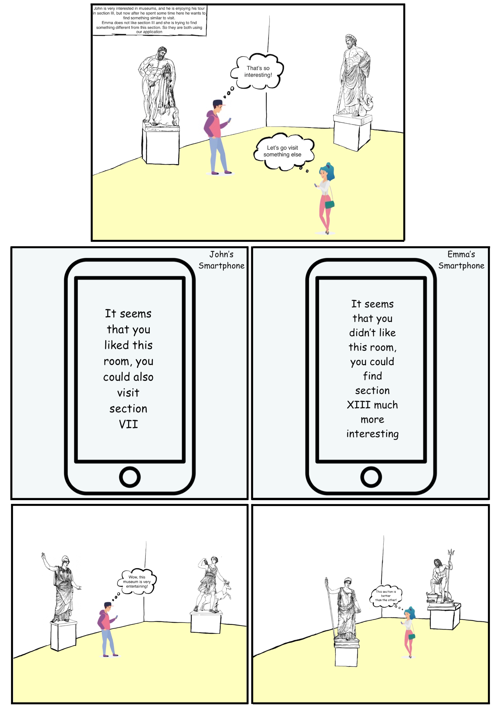

# Design document
**Our idea**

Our idea is to build a web application that runs on your smartphone. It can suggest the next room you could visit based on the time you have spent in the previous rooms.  A user could run the web application during the whole duration of the museum tour, so that the smartphone starts collecting data, in an anonymous way, to make the best suggestion for every user. The suggestion will be sent every time a user is leaving a room.

**User Personas**

**Storyboard**

