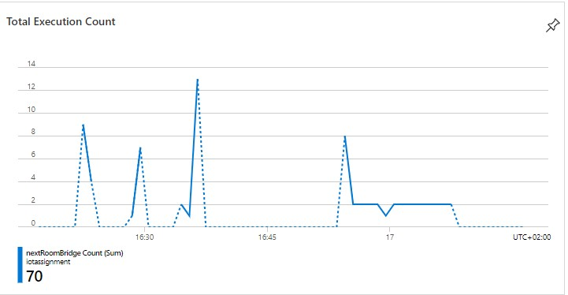

# 3rd Delivery

## Comments received during the 2nd presentation

We have presented our idea to our IoT class and the main critiques were:

1. An advice that professors gave us is to improve our solution for the covid-19 problem. So taking into account not only the number of people present in each section of the musem but also the respect of the distance between people. We decided to follow this advice and try this difficult challenge.

2. We used Bluetooth beacons, but we want to underline the fact that our beacons are not passive, so we called them beacon in an unproper way. The iot boards are active components of our project infact they communicates with the smartphones and with the cloud infrastructure.

## Our solution

Taking into account these useful advices and critiques, we came out with the following solutions:

1. We really appreciated the advice that professors gave us, we decided to include another feature to our application estimating the proximity of two different visitor and check if they are respecting the security distance.
2. Our IoT boards use BLE to monitor the tours that people are enjoying in the museum. The boards scan the area and check wheter there are movement inside the section they cover, if it is the case the board will send messagges to the IoT Hub triggering the start of the new generation of suggestions for the visitor.

## Changes from the 2nd delivery

The main changes from the second delivery are:

1. We decided to discard the idea of using a website, we have develeped instead a mobile application.

2. We faced the problem of social distancing, because of the COVID-19, inside our mobile application and added that to our project.

## Technical work done for the 3rd delivery

Our work, from a technical point of view done for the 3rd delivery:

1. We have finished the cloud infrastructure to make the system work:

    1.1. Now there is an endpoint reachable from the mobile application to connect to the cloud infrastructure also the smartphones.

    1.2. Fixed the type of messages that the board send to the IoT Hub.

2. We have finished the first version of the mobile application written in Flutter that gives suggestion about the next room to visit, taking into account the taste of the visitor and the crowding situation in each section.

## Evaluation done

1. We plan to do a load test with an ad hoc MBED OS program that performs a simulation of 20 BLE devices in a single section. If the board can handle this load, looking a the space available in each section we can be happy about that. Otherwise the computation will be done using the computational power of the cloud.

2. We have tested our cloud architecture.

    Eventually we have tuned the time of the data collection to make the system efficient enough for our purposes. Our target remains to manage 20 devices per room.

    So we have performed a simulation, through a Python script, sending data to the cloud and analyzing the behaviour of our algorithm. We discovered that saving data to the DB, is an important bottleneck, so we have decided to collect the data from the board at least every 30 seconds after the previous data collection.

    The graph below shows the tuning that we have done, starting from a high number of execution per minute and fixing this to 2 for minute as we have said.
    

3. We have tested the feature that aim to calculate the distance between two visitor, as we expected is not too precise and this is due to the fact that every vendor use different blueetooth sensor on their smartphone, so the RSSI at one meter that is used to estimate the distance is not rigorous.

    We have a lot of false positive during our test, so we decided to introduce a threesold, if we detect that two people are too near to each other for more than three times we would notiche to them. In this way we find out that the system works better, but there are still to many case in which one person is keeping the distance between another but the system will notify them that they are too close.

    We could try to improve our relevation system using some kind of triangulation if the we will place the board in some fixed position near the statue, but for the moment we are not expecting to do that.

## What we would like to implement in the future

A brief list of the functionality that is still missing and which you aspect you did not manage to evaluate.