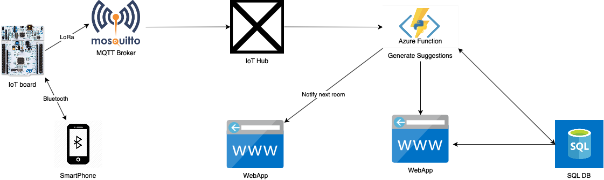

# Architecture

## Board's features

### BLE

We will use BLE technology. In this way an IoT device will recognize the smartphones in one section that will send a BLE message to the nearest board to state that they are nearby.
We used
[Mbed OS BLE](https://os.mbed.com/teams/Bluetooth-Low-Energy/)
[Flutter Blue](https://pub.dev/packages/flutter_blue)

### MQTT

Our initial idea was to use LoRa and TTN to communicate between the boards present in each section, and Azure IoT Hub, but after a load test we councluded that this was not suitable for our solution. So we changed our mind and decided to use MQTT for this purpose.
[The MQTT Standard](https://it.wikipedia.org/wiki/MQTT)

## Cloud infrastructure

### MQTT broker

To use the MQTT protocol it is essential to use an MQTT broker. To perform our imulation this MQTT broker will be run on our laptop using [Mosquitto](www.mosquitto.org) but in the museum this task will be implemented by a dedicated board, or by another computer that has to always listen to MQTT messages to allow the system to work correctly.

### Azure IoT Hub

We are using the Azure IoT Hub service as a central message hub to communicate between the application and the devices. The data will arrive to the IoT Hub. Using an Azure Function we can redirect this flow of data to an Azure SQL DB, and process them in order to generate suggestions

### Data Processing

Basically there will be an Azure function that will perform three tasks:

1. Redirect the incoming data flow from the Azure IoT Hub to an SQL DB in order to easily retrieve the history of past visits. This is fundamental for our algorithm to work.
2. Redirect the incoming data flow from the Azure IoT Hub to the curators' dashboard through an HTTP POST message
3. Implement an algorithm that generates a sorted list of suggestions basing its choice on the sum of two scores: a similarity score between the current visit and the others present in the database,  and a score computed on how many people are currently in the section (this will increment as the number of people becomes smaller). The algorithm sorts the list of section in in a decreasing order, using the computed score as a key, and send the list of suggestions to the web application through a HTTP POST message.

### Smartphone application

We will use an application, written in Flutter, to handle the start of the visit at the museum and the relative information to enter in the first phase.
The application will receive info on the next interesting sections to see during the visit based on the time spent in the previous sections, and based on how many people are currently in that section.
The application will also estimate distance between the user smartphones and the other ones, using bluetooth RSSI and processing it with this formula:
Estimated_Distance $= 10^((-47-RSSI)/(10*3))$

The old version of this document can be found [here](OlderVersions/Architecture02)