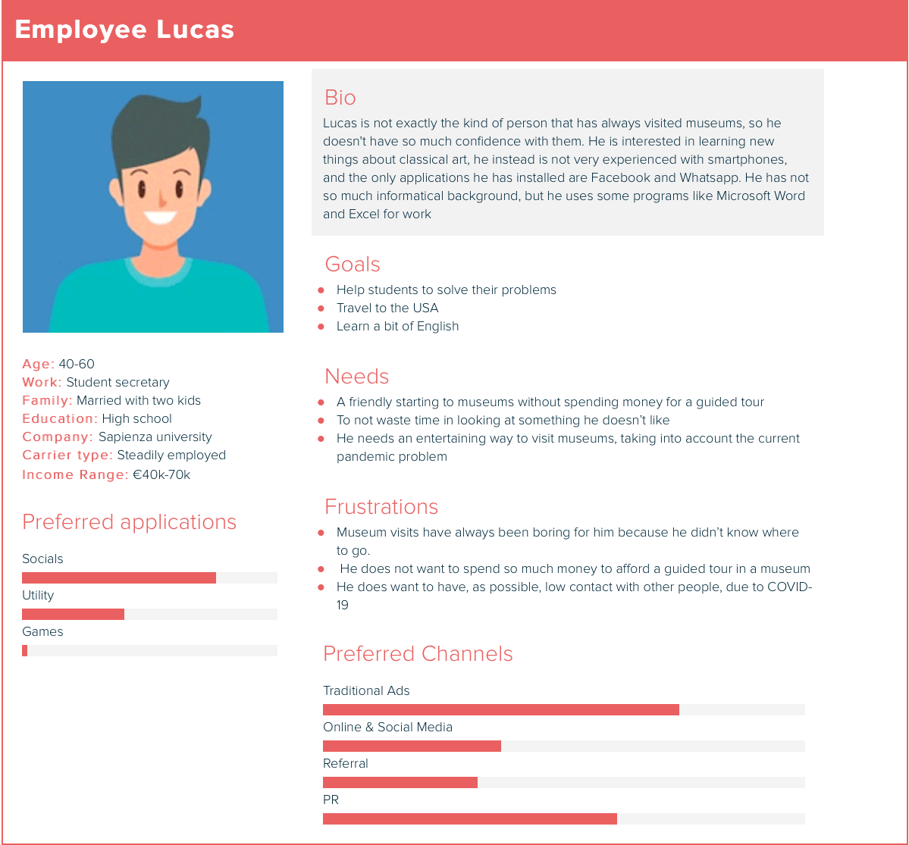
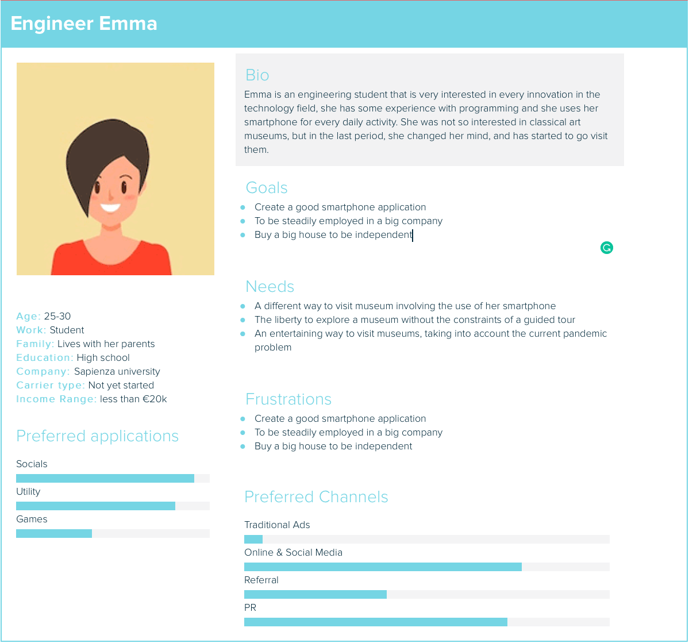
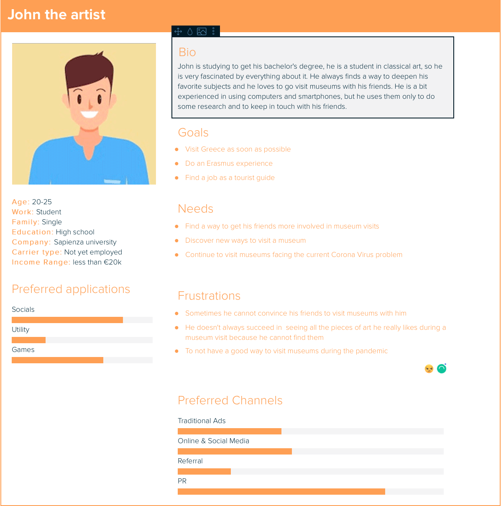
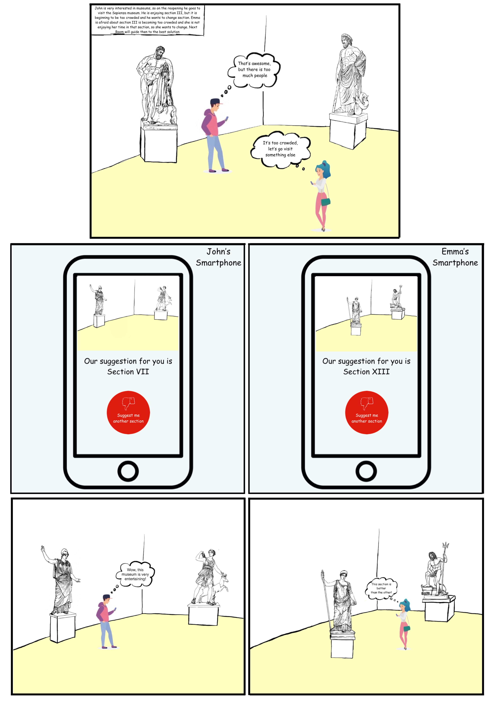

# Design document
## Our idea

In these days we are facing the problem of reopening activities after the lockdown. Our idea is to build a web application for a smartmuseum that runs on your smartphone. It will help to control the flow of people incoming in the museum without imposing some strict restrictions on the number of people that can visit the museum at once. During a tour in the Sapienza "Museo dell'Arte Classica", it can suggest the next section you could visit based on the time you have spent in the previous sections and on the number of people that is currently in each section.  A user could run the smartphone application "NextRoom" during the whole duration of the museum tour, so that the boards that are placed in each room/section of the museum start collecting data, in an anonymous way, to make the best suggestion for every user. The suggestion will be sent every time a user is leaving a section.

## User Personas

## Storyboard

The old version of this document can be found [here](OlderVersions/Design02)
