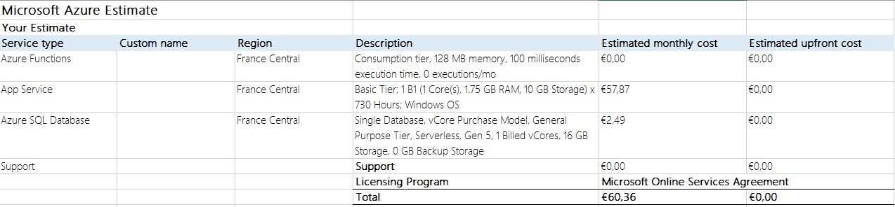

# Evaluation

This document defines how the evaluation of this project have been carried out. We did considerations from both the technical point of view, and the user experience part.

## User point of view

### User experience evaluation

Reveals how user feels about your design choices.

User experience:

* How a person feels about using a system
* Beyond pragmatic utility and usability
* Subjective, holistic, emotional, long-term

### How we will evaluate user experience

For this project we decided to gather data, in an anonimous way, from user application on how much time they spend in each section and how much time they visited all parts in the museum.

We thought that in a real scenario we could use these data, and create a score based on how much time a user spends in the suggested section of the museum. But due to the current situation, and to our difficulty on testing the application in a real scenario, this evaluation becomes complex.

So we evaluated the user experience using mockups, and after every demo of these prototypes we will collect people's opinions asking for feedbacks, trying to improve UX and to make our application more and more interactive. The main feedback that emerged from this kind of evaluation is that it could be cool if the application presents a map of the museum with the spot in which the user is, and the room he or she is suggested to visit. This is part of our future works.

## Technical point of view

The evaluation of the technical part is fundamental for the evaluation of the entire system, because its main goal is to understand the behaviour of the system under real use cases.

From these data it is possible to understand if the project is feasible in a real-world scenario. In our case this evaluation has been carried on to understand if it is possible for the system to handle a sufficent number of users present at the same time in the Sapienza "Museo dell'Arte Classica".

### How we evaluated the technical part

To evaluate the system from a technical point of view the main thing that we could do was to do tests on the maximum load that it can handle. This operation, to better understand the performances of the single parts of the system, can be carried on each of them. So we did some load tests on:

* **Smartphone distances** Smartphone-Smartphone interaction
  * With this test we experimented the accuracy of the estimated distance by our application from other people, taking different estimations with distances that were known, to calculate the average error of this estimation.

* **BLE** IoT device-Smartphone interation: how many smartphones a single device can handle?
  * In this part we performed a load test, trying to understand the limitations of the BLE sensor of the board when multiple devices are detected, and the capability of the board of storing data that begins to grow in size. We had not available multiple devices to connect to the board, but we thought to conduct a simulation using the same device to connect to the board within a short period of time before it sends the list of devices to the cloud and empties the list.
  * We addressed the noisy data problem giving the smartphone the responsability to send ping messages to the nearest board, making the detection more accurate.
* **Cloud** IoT device-Cloud interation: what is the message rate with which the device can send messages to Azure IoT hub?
We tested whether our cloud architecture is efficient enough for our purposes, our target remains to manage 20 devices per room. So we will performed a simulation, through a Python script, sending data to the cloud and analyzing the behaviour of our algorithm, taking into account that saving data to the DB, from what we have experienced, is an important bottleneck.
* **Responsiveness** Cloud-Smartphone interaction: how fast the smartphone receives the advice on where to go, does it depend from the number of connected devices?

### Pricing evaluation

The first cost to take into account is the board one; we know that it's necessary to place at least one board for each section of the museum. Looking at the [map](Images/planimetry.jpg) of the musem we see clearly twenty rooms. The board that we will use is the [B-L475E-IOT01A Discovery kit](https://www.st.com/en/evaluation-tools/b-l475e-iot01a.html) that has a retail price of about 50€. Altough the museum could have twenty rooms, but only ten sections or less; considering at least two rooms per section, the estimated cost will be around 500€.

For what concerns the cloud architecture these are the estimated costs:

* Azure Function: the first 400,000 GB/s of execution and 1,000,000 executions are free. Then you pay what you consume (serverless)

* App service: The basic plan cost around 60€, for testing purpose we will use the free one.

* Azure SQL Database: We choose to use the serverless option also in the DB, we use the maximum size of 15GB but it is possible to use more space.

So the expected monthly cost is around 60€, with the one time cost of the board purchase.

Below a graph explaining the power,in term of saving money, of the serverless choice:

The old version of this document can be found [here](OlderVersions/Evaluation02)
